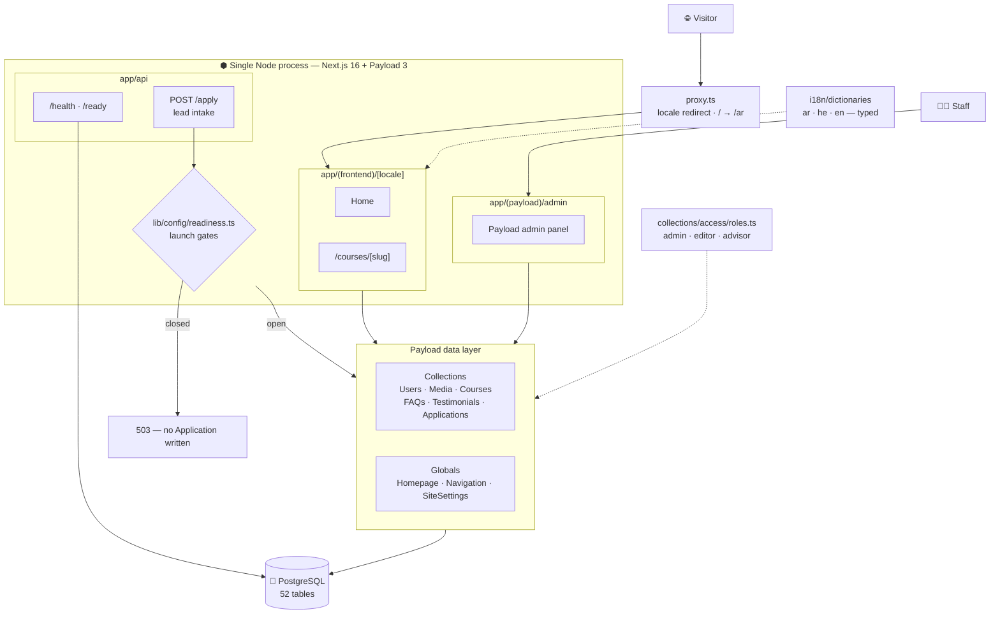
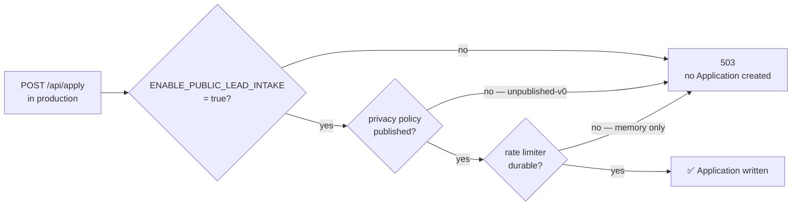

<div align="center">


<p>
  
  
  
  
  
  
</p>

<p>
  
  
  
  
  
</p>

</div>

---

Multilingual marketing site and lead-intake system for a beauty academy,
built on Next.js with Payload CMS embedded in the same application.

Arabic is the default language and the site is RTL-first; Hebrew (RTL)
and English (LTR) are also supported.

**Status: not deployed.** The application is feature-complete and
production-ready in the engineering sense, but has never been launched.
Several launch blockers are deliberate and require human decisions —
see [docs/DEPLOYMENT.md](docs/DEPLOYMENT.md).

---

## Stack

| | |
| --- | --- |
| Framework | Next.js 16.3.2 (App Router, Turbopack) |
| UI | React 19.2.8 |
| CMS | Payload 3.88.0, mounted inside the Next app |
| Database | PostgreSQL via `@payloadcms/db-postgres` 3.88.0 |
| Styling | Tailwind CSS 4 |
| Validation | Zod 4 |
| Animation | Motion 13 |
| Runtime | Node.js 24 LTS |
| Package manager | pnpm 11.22.0 (pinned via `packageManager`) |

`engines` in `package.json` enforces the Node and pnpm versions. There
is no separate CMS server, no separate API service, and no queue — one
Node process serves the public site, the admin panel, and the API.

### External services

Exactly one is required today: **PostgreSQL**. Everything else — object
storage, email delivery, a rate-limit backend, error tracking — is
either unconfigured or intentionally deferred, and each is listed with
its consequence in [docs/DEPLOYMENT.md](docs/DEPLOYMENT.md).

---

## Architecture

One Node process serves three surfaces — the public site, the Payload
admin panel, and the API — against a single PostgreSQL database.



**Request paths.** A visitor hits `proxy.ts` first, which resolves the
locale before any page renders. Staff go straight to the admin panel,
which is mounted inside the same app rather than deployed separately.
Both read through the same Payload collections, so content published in
the admin appears on the site without a rebuild step.

**The lead-intake path is guarded server-side.** `POST /api/apply` is
evaluated against `readiness.ts` before it does any work — a request
crafted to bypass the UI still gets a 503 and creates nothing. The gates
are described in full below.

---

## Layout

```
src/
  app/(frontend)/[locale]/   public site: home + /courses/[slug]
  app/(payload)/admin/       Payload admin panel
  app/api/apply/             public lead intake (POST)
  app/api/health/            liveness probe
  app/api/ready/             readiness probe (checks the database)
  app/robots.ts sitemap.ts   SEO, both force-dynamic
  collections/               Users, Media, Courses, FAQs,
                             Testimonials, Applications
  globals/                   Homepage, Navigation, SiteSettings
  i18n/dictionaries/         ar / he / en UI strings, typed
  lib/config/readiness.ts    production-readiness policy (pure)
  lib/rateLimit.ts           rate-limit abstraction
  migrations/                Payload/Drizzle migrations (generated)
  proxy.ts                   locale redirect (Next 16's middleware)
  scripts/                   operational scripts
  seed/                      non-destructive content seed
```

`src/proxy.ts` is the file Next 16 renamed `middleware.ts` to; it
redirects `/` to `/ar` and handles locale routing.

---

## Local development

```bash
pnpm install
cp .env.example .env      # then fill in DATABASE_URI and PAYLOAD_SECRET
pnpm dev
```

Open http://localhost:3000 (redirects to `/ar`) and
http://localhost:3000/admin.

The first visit to `/admin` on an empty database prompts you to create
the first user, who becomes the admin. Optionally run `pnpm seed`
afterwards to populate demo content.

In development Payload pushes schema changes to the database
automatically, so you do not need to run migrations while iterating.

### Commands

| Command | Purpose |
| --- | --- |
| `pnpm dev` | development server |
| `pnpm build` | production build (never touches the database) |
| `pnpm start` | run the production build (`NODE_ENV=production`) |
| `pnpm lint` | ESLint |
| `pnpm typecheck` | `tsc --noEmit` |
| `pnpm seed` | non-destructive content seed |
| `pnpm payload:migrate` | apply pending migrations |
| `pnpm payload:migrate:create` | generate a migration from config changes |
| `pnpm payload:migrate:status` | show which migrations have run |
| `pnpm verify:production` | check configuration readiness |

Payload's own destructive commands (`migrate:fresh`, `migrate:reset`,
`migrate:refresh`) exist but are deliberately **not** wired to `pnpm`
scripts, so they cannot be run by muscle memory.

---

## Environment variables

`.env.example` is the contract and marks each variable
`[required]` / `[required-prod]` / `[optional]` / `[public]`. Summary:

| Variable | Notes |
| --- | --- |
| `DATABASE_URI` | PostgreSQL connection string. Required. |
| `PAYLOAD_SECRET` | Signs sessions. Required. Generate per environment; never commit. |
| `NEXT_PUBLIC_SERVER_URL` | Absolute site origin. Drives canonicals, hreflang, sitemap. |
| `ALLOW_SEARCH_INDEXING` | Only `true` allows crawling. Fail-safe: unset means noindex. |
| `ENABLE_PUBLIC_LEAD_INTAKE` | In production, only `true` plus the two conditions below opens the form. |
| `PRIVACY_POLICY_VERSION` | Recorded with each lead. Defaults to `unpublished-v0`, which blocks launch. |
| `RATE_LIMIT_DRIVER` | Selects the limiter. Only `memory` exists today; it is not durable. |

Never set `PAYLOAD_DROP_DATABASE` outside a throwaway database — it
drops every table.

---

## Three gates worth understanding before you change anything

These look like restrictions and are load-bearing. Each is enforced on
the server; a browser cannot bypass any of them.



**1. Search indexing.** `robots.ts` and page metadata emit `noindex`
unless `ALLOW_SEARCH_INDEXING=true`. Unset is safe, so a forgotten
staging environment cannot be indexed.

**2. Public lead intake.** `isPublicLeadIntakeEnabled()` in
`src/lib/config/readiness.ts` is the single source of truth. In
production it requires *all three*: the flag set to `true`, a published
privacy policy version, and a durable rate limiter. When it is off,
`ApplyCTA` renders a neutral unavailable message instead of the form
**and** `POST /api/apply` returns 503 before doing any work — so a
crafted request creates no Application. The public message states no
internal reason and promises no response time.

**3. Rate limiting.** `src/lib/rateLimit.ts` defines a `RateLimiter`
interface with one in-memory implementation. In-memory is per-process
and resets on restart, so it is not listed as durable, so production
lead intake stays closed. Adding a durable driver means writing one
implementation and adding its name to `DURABLE_RATE_LIMIT_DRIVERS` —
the extension point documents the correct atomic Postgres approach
(`INSERT … ON CONFLICT DO UPDATE … RETURNING`), which matters: a
read-then-increment implementation is race-prone under concurrency.

Run `pnpm verify:production` to see all of this evaluated at once. It
reports two separate verdicts — *ready for deployment* and *ready for
public launch* — and prints presence, never values, for secrets.

---

## Roles

Payload Users have one of three roles:

- **admin** — full access, including creating users and changing roles.
- **editor** — content only; cannot see Applications at all.
- **advisor** — reads and updates Applications (leads); cannot create
  or delete them, and cannot see content collections.

Role escalation is blocked at the field level, so a non-admin cannot
promote themselves even via a direct API call. `advisor` is the safe
default for a new account.

---

## Migrations

Migrations are formal and committed. `src/migrations/` holds a baseline
representing the full current schema (52 tables), and each subsequent
change gets its own migration.

After changing any collection, global, or field:

```bash
pnpm payload:migrate:create
```

This diffs the committed snapshot against the current config — it does
not read your database and does not need one running. Commit the
generated `.ts`, `.json`, and the regenerated `index.ts` together.

Migrations are **not** run automatically on boot (Payload's
`prodMigrations` option is deliberately unused). Deployment runs them
as an explicit, observable step. CI proves on every PR that the
committed migrations build the schema from empty and that Payload can
then run against it with `NODE_ENV=production` — which is what catches
a forgotten `migrate:create`.

---

## CI

`.github/workflows/ci.yml` runs two jobs on pull requests to `main`:

- **Lint & Build** — lint, typecheck, build, and `verify:production`.
  No database service is attached, on purpose: the build must never
  need one.
- **Migration smoke test** — a disposable `postgres:17` service,
  migrations applied from empty, then Payload initialized against the
  result under `NODE_ENV=production`.

---

## Deploying

Read these in order:

1. **[docs/DEPLOYMENT.md](docs/DEPLOYMENT.md)** — production topology,
   the capabilities a host must provide, and the blocker map.
2. **[docs/RUNBOOK.md](docs/RUNBOOK.md)** — the 19-step deployment
   sequence, backups, and the rollback model.

The short version: provision Postgres → verify backups by restoring one
→ set environment variables → `pnpm verify:production` → run migrations
→ build → start → check `/api/health` and `/api/ready` → domain and
TLS → **publish the real privacy policy** → enable lead intake →
enable search indexing last.

**Code and schema roll back differently.** Redeploying the previous
build does not undo a migration. `docs/RUNBOOK.md` covers both paths.

---

## Things that are deliberate

Changing any of these without understanding why they exist will cause
a real problem:

- **No online payments anywhere.** No checkout, cart, order, or payment
  model — by explicit business rule, not oversight.
- **No invented business facts.** Copy, contact details, structured
  data, and testimonials only assert what the business has confirmed.
  Do not add plausible-sounding claims, prices, ratings, or credentials.
- **Uploads go to local disk.** Fine for development; on an ephemeral
  filesystem the files vanish on redeploy while their database rows
  survive. Configure object storage before real photography is uploaded.
- **No privacy policy text is written here.** It requires legal review;
  the application fails safely without it rather than shipping
  placeholder legalese.
- **No CSP or HSTS in `next.config.ts`.** Four other security headers
  are set. CSP needs measurement against the real admin bundle, and
  HSTS is a commitment about a domain that does not exist yet — both
  belong at the edge, with reasoning documented in the config.
